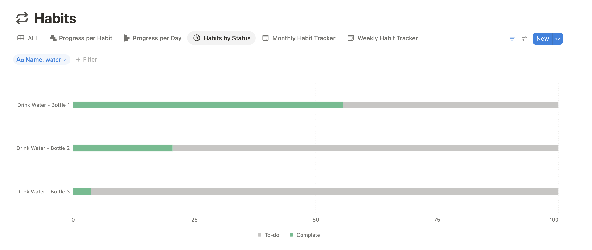

Hi there! I'm **[Hadley](http://hadleyrose.io)**, a full-time caffeinator, wanna-be writer, and lover of code and cartoons alike.

When I'm not digging deep into spreadsheets or jamming on [my (Notion) planner](https://raw.githubusercontent.com/hadleyrose/webby/2f85451ce6a3720173ddf87d8aa0a610ef8a0a7b/public/assets/images/JamminPlanner.png), you can find me at the nearest bookstore or cinema or cozied up with my [furballs](https://raw.githubusercontent.com/hadleyrose/webby/2f85451ce6a3720173ddf87d8aa0a610ef8a0a7b/public/assets/images/CagneyBanner.png) and family in front of the TV.

Get to know me on socials or reach out [via email](mailto:hadleyrosemitchell@gmail.com?subject=Hello%20Hadley%21).

- 🐍 I'm a Pythonista, baby! I have professional and hobbyist experience with pandas, huggingface, spaCy, beautifulsoup, flask, scikit-learn, pyspark, nltk, and many many more. Check out examples of my work [here](https://github.com/search?q=owner%3Ahadleyrose+language%3Apython+language%3A%22Jupyter+Notebook%22+&type=repositories).
- 🗂️ I love to organize, analyze, and visualize data--even in my personal life! My Bottles of Water streak is abysmal, but at least we can learn from it!

- 📠 Version control is life. Project management is euphoria. I love JIRA filters, Shotgrid dashboards, and code reviews with clear and concise Pull Requests.
- 📝 I'm passionate about documentation and teaching. Tutorials detailing setup, bug troubleshooting, and project methodology are some of my greatest achievements.
- 🎨 I'm an animation lover and Blender enthusiast; my [website](http://hadleyrose.io) features my own Blender models and showcases my [experience learning](https://github.com/hadleyrose/webby) 11ty, vite, and three.js.

<!--
**hadleyrose/hadleyrose** is a ✨ _special_ ✨ repository because its `README.md` (this file) appears on your GitHub profile.

Here are some ideas to get you started:

- 🔭 I’m currently working on ...
- 🌱 I’m currently learning ...
- 👯 I’m looking to collaborate on ...
- 🤔 I’m looking for help with ...
- 💬 Ask me about ...
- 📫 How to reach me: ...
- 😄 Pronouns: ...
- ⚡ Fun fact: ...
-->
